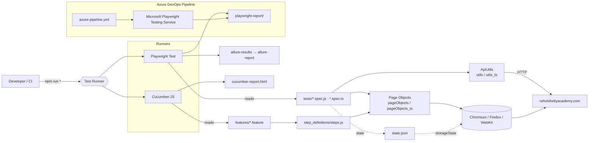

# PlayWrightAutomation_Rahul

[](https://nodejs.org/)
[](https://playwright.dev/)
[](https://cucumber.io/)
[](https://www.typescriptlang.org/)
[](https://docs.qameta.io/allure/)
[](https://opensource.org/licenses/ISC)

End-to-end test automation framework built with [Playwright](https://playwright.dev/) (JavaScript + TypeScript) and Cucumber BDD. Includes page objects, API utilities, Allure reporting, and an Azure DevOps pipeline.

---

## Table of Contents

- [Overview](#playwrightautomation_rahul)
- [Tech Stack](#tech-stack)
- [Architecture](#architecture)
- [Project Structure](#project-structure)
- [Prerequisites](#prerequisites)
- [Quick Start](#quick-start)
- [Getting Started](#getting-started)
- [Test Data & Environment](#test-data--environment)
- [Running Tests](#running-tests)
- [Reports](#reports)
- [CI/CD](#cicd)
- [Troubleshooting](#troubleshooting)
- [Contributing](#contributing)
- [Remotes](#remotes)
- [Author](#author)
- [License](#license)

---

## Tech Stack

- **Playwright** (`@playwright/test`) — browser automation
- **Cucumber** (`@cucumber/cucumber`) — BDD feature files
- **TypeScript** — typed page objects and utilities
- **Allure** — reporting (`allure-playwright`, `allure-commandline`)
- **ExcelJS** — spreadsheet-driven data
- **Azure Playwright** (`@azure/playwright`) — cloud test execution

## Architecture



## Project Structure

```
PlayWrightAutomation_Rahul/
├── tests/                         # Playwright test specs (.spec.js / .spec.ts)
│   ├── ClientApp.spec.js
│   ├── WebApiPart1_10_51.spec.js
│   └── ...
├── features/                      # Cucumber BDD
│   ├── Ecommerce.feature
│   ├── ErrorValidations.feature
│   ├── step_definitions/
│   │   └── steps.js
│   └── support/
│       └── hook.js
├── pageObjects/                   # Page Object Model (JavaScript)
│   ├── LoginPage.js
│   ├── DashboardPage.js
│   ├── CartPage.js
│   ├── OrdersReviewPage.js
│   ├── OrdersHistoryPage.js
│   └── POManager.js
├── pageObjects_ts/                # Page Object Model (TypeScript mirror)
├── utils/                         # API utilities & test data (JS)
│   ├── ApiUtils.js
│   ├── test-base.js
│   └── placeorderTestData.json
├── utils_ts/                      # API utilities & test data (TS mirror)
├── allure-results/                # Raw Allure output (gitignored in real projects)
├── allure-report/                 # Generated Allure HTML report
├── state.json                     # Saved browser storageState (auth token)
├── playwright.config.js           # Default Playwright config
├── playwright.config1.js          # Alternate config (Safari / projects)
├── playwright.service.config.js   # Config for Microsoft Playwright Testing
├── azure-pipeline.yml             # Azure DevOps CI pipeline
├── cucumber-report.html           # Latest Cucumber HTML report
├── package.json
└── README.md
```

## Prerequisites

- **Node.js** 18 or newer ([download](https://nodejs.org/))
- **npm** 9+ (ships with Node.js)
- **Git** ([download](https://git-scm.com/))
- ~500 MB disk space for browser binaries
- Internet access (tests hit the public practice site [rahulshettyacademy.com](https://rahulshettyacademy.com/))

## Quick Start

Get a green test run in under 2 minutes:

```bash
# 1. Clone
git clone https://github.com/samirjagtap4030/PlayWrightAutomation_Rahul.git
cd PlayWrightAutomation_Rahul

# 2. Install deps + browsers
npm install && npx playwright install

# 3. Run one spec and open the report
npx playwright test tests/ClientApp.spec.js
npx playwright show-report
```

## Getting Started

### Install

```bash
git clone https://github.com/samirjagtap4030/PlayWrightAutomation_Rahul.git
cd PlayWrightAutomation_Rahul
npm install
npx playwright install
```

## Test Data & Environment

Test data and browser state are tracked in the repo for convenience (target app is the public practice site [rahulshettyacademy.com](https://rahulshettyacademy.com/)):

| File | Purpose |
| --- | --- |
| `utils/placeorderTestData.json` / `utils_ts/placeorderTestData.json` | Credentials & product names driving data-driven tests |
| `state.json` | Saved `localStorage`/cookies so tests can skip the login step |

> ⚠️ **If you fork this repo for a real project**, move secrets to environment variables (e.g. via `dotenv`) and add `state.json` + test-data JSON to `.gitignore`. The commented `dotenv` block in `playwright.config.js` shows the pattern.

### Regenerating `state.json`

```bash
# Log in manually once with Playwright codegen, then save storage state
npx playwright codegen https://rahulshettyacademy.com/client --save-storage=state.json
```

## Running Tests

| Command | Description |
| --- | --- |
| `npm run regression` | Run the full Playwright test suite |
| `npm run webTests` | Run tests tagged `@Web` |
| `npm run APITests` | Run tests tagged `@API` |
| `npm run safariNewConfig` | Run Safari project with alternate config |
| `npm run CucumberRegression` | Run Cucumber `@Regression` scenarios (HTML report) |

### Useful ad-hoc commands

```bash
# Run a single spec
npx playwright test tests/ClientApp.spec.js

# Run headed / with UI mode / in debug
npx playwright test --headed
npx playwright test --ui
npx playwright test --debug

# Run against a specific browser project
npx playwright test --project=chromium
```

### Example output

```
Running 14 tests using 3 workers

  ✓  [chromium] › tests/ClientApp.spec.js:12:5 › place order end-to-end (8.1s)
  ✓  [chromium] › tests/WebApiPart1_10_51.spec.js:9:5 › api: token + UI order (5.4s)
  ✓  [chromium] › tests/UIBasic.spec.js:7:5 › dashboard loads (3.2s)
  ...

  14 passed (42.6s)

To open last HTML report run:
  npx playwright show-report
```

## Reports

| Report | Location | View |
| --- | --- | --- |
| Playwright HTML | `playwright-report/` | `npx playwright show-report` |
| Cucumber HTML | `cucumber-report.html` | Open in any browser |
| Allure | `allure-results/` → `allure-report/` | `npx allure generate allure-results --clean && npx allure open` |

Screenshots and traces are enabled by default (`screenshot: 'on'`, `trace: 'on'` in `playwright.config.js`) — failed tests will produce `.zip` traces you can open with:

```bash
npx playwright show-trace path/to/trace.zip
```

## CI/CD

- `azure-pipeline.yml` — Azure DevOps pipeline: installs deps, runs `Calender.spec.js` against the Microsoft Playwright Testing service, and publishes the HTML report as a pipeline artifact.
- Required pipeline variables:
  - `PLAYWRIGHT_SERVICE_URL` — endpoint of the Playwright Testing workspace
  - An Azure service connection named `rahulshettyacademy`

## Troubleshooting

<details>
<summary><strong>Browsers not installed / "Executable doesn't exist"</strong></summary>

Run `npx playwright install` — the first `npm install` doesn't download browser binaries automatically.
</details>

<details>
<summary><strong>Tests time out right after opening the page</strong></summary>

- Bump `timeout` in `playwright.config.js` (currently `60 * 1000`).
- If `state.json`'s token has expired, regenerate it (see *Test Data & Environment*).
</details>

<details>
<summary><strong>`headless: false` makes runs flaky</strong></summary>

The config intentionally runs headed for debugging. For CI or stable local runs, set `headless: true` and enable retries in `playwright.config.js`.
</details>

<details>
<summary><strong>Allure command not found</strong></summary>

`allure-commandline` is a dev dependency — invoke it with `npx allure ...` rather than a global `allure`.
</details>

## Contributing

1. **Fork** the repo and create a feature branch off `master`:
   ```bash
   git checkout -b feat/<short-description>
   ```
2. **Write / update tests** alongside any page-object changes. Keep JS and TS page objects in sync if you touch one.
3. **Run the suite locally** before pushing:
   ```bash
   npm run regression
   ```
4. **Commit** with a descriptive message (imperative mood — `Add login retry logic`).
5. **Open a Pull Request** against `master`. Describe *what* and *why*, and attach the HTML/Allure report if behavior changed.

### Branching model

- `master` — stable, always green
- `feat/*` — new tests or features
- `fix/*` — bug fixes
- `chore/*` — tooling, config, docs

## Remotes

This repository is mirrored to two remotes via a single `origin`:

- **Azure DevOps** — `dev.azure.com/samirjagtap14/testSpace/_git/testSpace`
- **GitHub** — `github.com/samirjagtap4030/PlayWrightAutomation_Rahul`

A single `git push origin master` pushes to both.

## Author

**Samir Jagtap**
[GitHub @samirjagtap4030](https://github.com/samirjagtap4030) · samirjagtap4030@gmail.com

## License

Released under the **ISC License** — see `package.json`.
